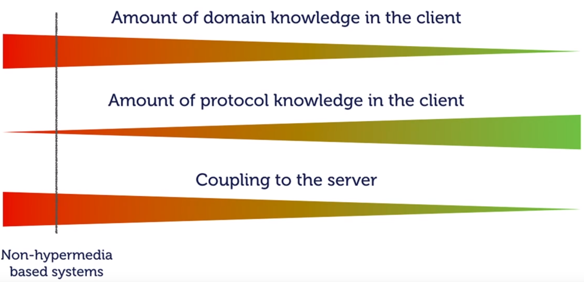

# Rest Api

## REST != CRUD via HTTP

## Representation design matters

- NOT uri
- 어떤 데이터를 담을 것인가?
- 누가 볼 것인가?
- 누가 관리하는가?

## REST Resources == Aggregate

- 식별성
- 참조가능
- 일관성 단위

## Hypermedia As The Engine Of Application State

- 데이터를 제공하면서, Navigation 정보까지 동시에 제공해야 함 (HATEOAS: Hypermedia As The Engine Of Application State)

- 그냥 JSON을 보내는 것과 HATEOAS까지 보내는 것은 복잡성 측면에서 크게 다르지 않다고 함.

- 왜 HATEOAS를 적용해야 할까?

    1. 도메인 자체의 복잡도와 프로토콜 자체의 복잡도(HATEOAS를 적용한 경우: 오 이건 특수한 형태의 JSON으로 이런 저런 링크가 동봉되어 있네 등을 클라이언트가 이해하는 등의 작업)

    2. HATEOAS를 적용하지 않으면 클라이언트에서 도메인 논리를 알아야 하는 양이 많아진다. 특히 초기에 매우 많아 서버와의 결합이 초기에 매우 크다. 그대신 프로토콜 논리는 적게 필요하다.

    

    3. 클라이언트에 프로토콜 논리를 담아 HATEOAS를 적용한다면, 클라이언트는 서버와의 결합도가 낮아지게 된다. uri 리팩토링 등의 작업이 발생하는 경우 `versioning`을 통해(당연히 이 작업은 새 api를 만드는 일과 동일함) 하위호환성을 제공해야 하는 일을 하지 않아도 된다.

    4. (3)의 경우가 중요한 환경은, MSA로 시스템을 구축했을 때거나 Multi Platform Client가 있을 때이다. dependency가 많기 때문에 서버 하나의 변경이 여러 클라이언트의 변경을 초래하게 된다.

## HATEOAS를 적용하여 서버와의 결합을 제거하는 방법

현재 HATEOAS를 적용하여 유리한 때가 API 수준이 변경될 때임을 보여주기 위해 예시를 하나 들겠다. 

예를 들어, 사용자가 보는 모든 Text에 대하여 i18n을 도입해야 한다고 하자.

1. 그동안 아래와 같은 API를 제공했다고 하자.

    ```json
    GET /orders

    {
        "_links": {
            "cancel": {
                "href": "...."
            }
        },
        "createdDate": "....",
        "status": "Payment Expected"
    }
    ```

    현재까지 클라이언트는 `status`를 그대로 표시하는 결정을 했다.

2. (1)과 같은 JSON은 `links` 속성이 같이 오는데, 이 때 클라이언트는 `status`를 JSON에서 그대로 읽어 표시하는 게 아닌, `cancel` 링크가 존재하는지 아닌지로 취소 버튼을 표시할 지 말 지를 결정함으로써, 일종의 도메인 논리에 의존하지 않고도 뷰를 구성할 수 있게 된다. 해당 링크를 서버에서 보내주느냐 마냐로 판단하면 되기 때문에, 클라이언트에서 추가적인 보안 검증 등의 과정이 필요 없게 된다.

## 도메인 개념을 웹에 적합한 것으로 바꾸기

1. 엔터티/애그리거트간의 관계를 Link로 표현하기

2. Id를 uri로 표현하기 (http에서는 uri가 unique한 식별자로 활용됨)

3. `@Version`을 `ETags`로 바꾸기

4. `Last Modified Property`를 `Last Modified Header`로 바꾸기
